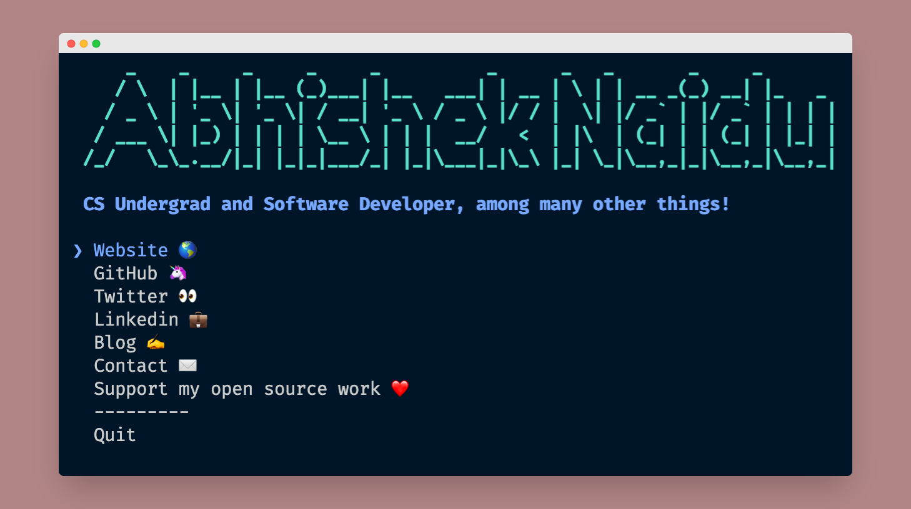

<h1 align="center">abhisheknaiidu</h1>
<p align="center">The <a href="https://blog.abhisheknaidu.tech">
    Abhishek Naidu
  </a> CLI</p>
<div align="center">
  <a href="https://www.npmjs.com/package/abhisheknaidu">
    
  </a>
  <a href="https://travis-ci.com/abhisheknaiidu/abhisheknaidu-cli">
    
  </a>
  </a>
  
<a href="https://discord.gg/XTW52Kt"></a><br>
  <a href="https://github.com/abhisheknaiidu/abhisheknaidu-cli/blob/main/license">
    
  </a>
  <a href="https://twitter.com/intent/tweet?text=Check%20out%20CLI%20of%20%40abhisheknaiidu%0A%0Ahttps%3A%2F%2Fgithub.com%2Fabhisheknaiidu%2Fabhisheknaidu-cli%0A%0A%23npm%20%23cli%20%23javascript%20%23opensource">
     
  </a>
</div>

<hr />
<div align="center">

</div>

## Table of Contents

- [Installation](#installation)
- [Libraries](#libraries)
- [LICENSE](#license)

## Installation

Ensure you have [Node.js](https://nodejs.org) 10 or later installed. Then run the following:

```
npx abhisheknaidu
```

## Libraries

- import-jsx
- ink
- ink-select-input
- meow
- node-banner
- open
- react

### Inspiration

[Sindre Sorhus](https://github.com/sindresorhus)
[Abhijith Vijayan](https://github.com/abhijithvijayan)

## License

[](https://creativecommons.org/publicdomain/zero/1.0/)

To the extent possible under law, [Abhishek Naidu](https://blog.abhisheknaidu.tech/) has waived all copyright and related or neighboring rights to this work.
